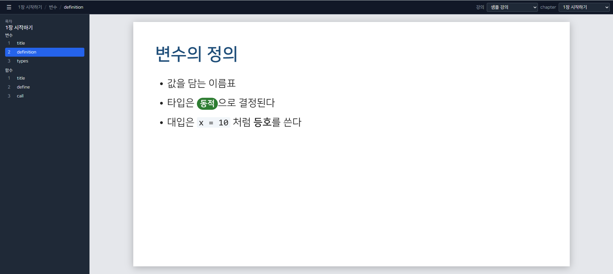

# course-maker

## 1. 소개

강의자료를 쉽게 만들도록 도와주는 도구입니다. 슬라이드를 TSX 파일로 작성하고, 브라우저의 미리보기 창에서 바로 확인합니다. Claude Code 같은 AI 도구에 슬라이드 수정을 시킬 수도 있습니다.



- 슬라이드는 16:9(1920×1080) 한 장이 TSX 파일 하나입니다.
- 강의 내용은 `courses/` 아래에서 강의별로 따로 관리합니다.
- 레포지토리를 내려받아 **내 컴퓨터에서** 사용하는 도구입니다. 서버에 배포하는 서비스가 아닙니다.

## 2. 현재 상태

| 기능 | 상태 |
|---|---|
| 미리보기 창 (목차, 강의/chapter 선택, 슬라이드와 chapter 이동 버튼, 방향키, chapter 기준 번호) | 사용 가능 |
| 파일을 고치면 미리보기에 바로 반영 | 사용 가능 |
| 슬라이드 요소: 제목, 문단, 불릿, 인라인 서식(뱃지, 굵게, 코드) | 사용 가능 |
| 슬라이드 마스터와 layout (대제목, 목차, 컨텐츠, 제목만 있는 컨텐츠), 강의 전용 마스터 | 사용 가능 |
| 위치를 정해 놓는 요소: 글, 도형, 이미지, 칩, 프롬프트 상자 (칩과 프롬프트 상자의 아이콘은 선택), 도형과 글자의 글로우(네온) | 사용 가능 |
| chapter 바로 아래의 슬라이드: section 앞(`head`: 대제목, 목차)과 뒤(`tail`: 진행 현황 등) | 사용 가능 |
| 목차 (chapter의 section으로 자동으로 채움) | 사용 가능 |
| 강의 전용 요소 (`courses/{강의}/elements/`) | 사용 가능 |
| 강의 template (`default-course` GitHub template 저장소) | 사용 가능 |
| 숨김 슬라이드 (미리보기에서는 보이고 번호에는 세지 않으며 내보낼 때 제외) | 미리보기만 (내보내기는 아직 없음) |
| 표, 날짜/바닥글/슬라이드 번호 | 아직 없음 |
| 단일 HTML 파일로 내보내기 | 아직 없음 |
| PPTX로 내보내기 (슬라이드 마스터까지 PowerPoint 마스터로 내보낼 예정) | 아직 없음 |
| PDF로 내보내기 | 아직 없음 |

아직 개발 중인 버전입니다. **도구가 바뀌면 이미 만든 강의가 동작하지 않을 수 있습니다.** 정식 버전이 나오면 메신저로 알려 드립니다.

## 3. 준비물

- **Node.js v20.19.0 이상 (v21 제외), 또는 v22.12.0 이상**. 사용하는 도구(Vite 8 등)가 요구하는 최소 버전입니다. 직접 확인한 버전은 v24.19.0뿐이고, 그보다 낮은 버전은 도구가 지원한다고 밝힌 범위일 뿐 이 프로젝트에서 시험해 보지는 않았습니다.
  - `.nvmrc`에 `24.19.0`(확인한 버전)이 적혀 있어 nvm, fnm 같은 버전 관리 도구에서 참고할 수 있습니다. 강제하지는 않습니다.
  - `package.json`의 `engines`와 `.npmrc`의 `engine-strict=true` 때문에 위 범위보다 낮은 버전에서는 `npm install`이 오류를 내고 멈춥니다.
  - 확인: `node -v`
- **Git**
- **에디터**: VS Code 등 TSX 파일을 편집할 수 있는 것
- **Claude Code** (선택): AI에게 슬라이드 작성과 수정을 시킬 때 사용합니다.
- **OS**: Windows에서만 사용해 봤습니다. 다른 OS는 확인하지 못했습니다.

## 4. 5분 시작하기

```bash
git clone https://github.com/sehoon-pyo/course-maker.git
cd course-maker
npm install
npm run dev
```

도구를 업데이트하려면 `course-maker` 폴더에서 `git pull`을 합니다. 강의는 도구와 별도의 저장소(`courses/내강의/`)라 영향을 받지 않지만, 도구가 바뀌면 강의를 고쳐야 할 수 있습니다. 필요한 수정은 해당 ADR의 "강의에 필요한 수정"에 적어 둡니다.

터미널에 나오는 주소(기본값 `http://localhost:5173/`)를 브라우저에서 열면 샘플 강의가 보입니다.

- 왼쪽 위의 ☰ 버튼으로 목차를 접고 펼 수 있습니다.
- 상단 바에서 강의와 chapter를 고를 수 있습니다.
- 슬라이드 이동은 화면 아래의 `< 이전`, `다음 >` 버튼이나 방향키(← →)로 합니다. chapter 사이의 이동은 `<< 이전 챕터`, `다음 챕터 >>` 버튼이나 `Ctrl + ←`, `Ctrl + →`입니다. `<`, `>`는 chapter 끝에서 멈춥니다.
- 아래의 번호(`3 / 12`)는 **chapter 안**의 번호이고 사이드바의 번호도 chapter 안에서 이어집니다. 숨김 슬라이드는 번호를 매기지 않고 `숨김 / 12`로 보입니다.
- `courses/sample`의 슬라이드 파일을 고치고 저장하면 화면이 바로 바뀝니다.

## 5. 프로젝트 구조

```
course-maker/
├─ src/                    도구의 소스 (미리보기 앱)
│  ├─ elements/            슬라이드에서 쓰는 요소(Title, Bullets, Shape, Chip, Toc 등)와 인라인 서식
│  ├─ preview/             미리보기 창 (사이드바, 상단 바, 슬라이드 표시)
│  ├─ masters/             슬라이드 마스터를 정의, 검증, 조회, 그리는 코드와 도구가 제공하는 마스터
│  │                        도구가 제공하는 마스터는 없고, 마스터는 각 강의의 `masters/{id}/`에 둡니다
│  ├─ courses.ts           courses/ 폴더를 읽어 목차 트리를 만듦
│  ├─ types.ts             meta.ts의 타입
│  ├─ constants.ts         슬라이드 크기 (1920×1080)
│  └─ styles.css           폰트와 테마 값
│
├─ courses/                강의가 들어가는 곳 (강의 폴더마다 git 저장소를 만들어야 함)
│  ├─ sample/              예제 강의 (도구에 포함, 별도 저장소 아님)
│  ├─ sample2/             예제 강의 (도구에 포함, 별도 저장소 아님)
│  └─ my-course/           ← ★ 내 강의 (현재 프로젝트는 이 폴더를 무시함)
│     ├─ .git/             이 폴더에서 `git init` 한 별도 저장소
│     ├─ meta.ts           강의 제목, chapter 순서(`chapters`), 쓸 슬라이드 마스터 id (`master`, 없으면 default), section 이름(`sectionLabel`)
│     ├─ masters/          이 강의 전용 슬라이드 마스터 (선택)
│     ├─ elements/         이 강의 전용 요소 (선택). 도구의 요소를 다시 내보내고 이 강의의 요소를 더함
│     ├─ assets/           이 강의의 이미지(아이콘 등). 슬라이드와 요소가 가져다 씀
│     └─ ...               chapter, section, slide 구조는 아래 6번에 써 있음
│
├─ assets/fonts/           NanumSquare R, B
├─ docs/
│  ├─ github.md            GitHub 이슈와 프로젝트 운영 방법
│  ├─ notes/               논의 기록
│  └─ adr/                 결정 기록
├─ CLAUDE.md               AI 도구가 읽는 프로젝트 안내
└─ index.html, package.json, tsconfig.json, vite.config.ts
```

위 그림의 `courses/my-course/` 안쪽(chapter, section, slide)의 자세한 폴더 구조는 **아래 [6. 내 강의 만들기](#6-내-강의-만들기)에 써 있습니다.**

**슬라이드 마스터의 위치** (자세한 설명은 [7-3](#7-3-슬라이드-마스터))

- 도구가 제공하는 마스터: `src/masters/{마스터 id}/`
- 강의 전용 마스터: `courses/{강의}/masters/{마스터 id}/`
- 강의 하나는 **마스터 하나만** 씁니다. 강의 `meta.ts`의 `master`로 고르고, 없으면 `default`입니다.
- 마스터 id를 찾는 순서는 **① 강의 전용(`courses/{강의}/masters/`) → ② 도구 제공(`src/masters/`)** 입니다. 같은 id가 양쪽에 있으면 강의 전용이 우선합니다.

**`courses/` 아래에 강의를 만들면, 강의마다 별도의 git 저장소를 만들어야 합니다.**

```bash
cd courses/my-course
git init
```

- 도구 저장소는 `sample`과 `sample2`만 추적하고 `courses/` 아래의 나머지는 모두 무시합니다. 그래서 **강의 폴더에 git 저장소를 만들지 않으면 내 강의는 어디에도 기록되지 않습니다.** (변경 이력도, 백업도 없습니다.)
- 강의마다 저장소가 따로 있으면 도구를 업데이트(`git pull`)해도 내 강의 파일과 섞이지 않고, 강의 저장소를 비공개로 둘 수도 있습니다.

## 6. 내 강의 만들기

### 6-1. 강의 폴더 만들기

**권장: `default-course` template에서 시작합니다.** [`sehoon-pyo/default-course`](https://github.com/sehoon-pyo/default-course)는 강의의 초깃값(마스터, 대제목, 목차, section 구분, 컨텐츠, 제목만 있는 컨텐츠 예시)을 담은 GitHub template 저장소입니다.

1. 저장소 페이지에서 **Use this template**로 내 강의 저장소를 만듭니다. (내 계정에 새 저장소가 생기고 이력이 새로 시작됩니다.)
2. `courses/` 안에 clone합니다. 이때 폴더 이름이 강의 폴더 이름이 됩니다.

```bash
cd courses
git clone https://github.com/{내 계정}/{내 강의}.git my-course
```

- template은 **복사한 시점에 고정됩니다.** 그 뒤 template이 바뀌어도 내 강의에는 반영되지 않습니다.
- template을 `Use this template` 없이 그대로 clone해도 열리지만, `origin`이 `default-course`를 가리키므로 내 저장소를 만들어 `git remote set-url origin {내 저장소 주소}`로 바꿔야 합니다.
- template 자체를 고치려면 `courses/` 안에 `default-course`를 clone해서 고치고 푸시합니다. 도구 저장소는 `courses/*`를 무시하므로 섞이지 않습니다.

**다른 방법: 샘플을 복사합니다.**

```bash
# bash
cp -r courses/sample courses/my-course

# PowerShell
Copy-Item -Recurse courses/sample courses/my-course
```

복사한 폴더 안에서 **반드시 따로 git 저장소를 시작합니다.** (이유는 5번 프로젝트 구조 참고. template으로 시작했다면 이미 저장소입니다.)

```bash
cd courses/my-course
git init
```

### 6-2. 폴더 구조

```
courses/my-course/                 강의 (course)
├─ meta.ts                         강의 제목과 chapter 순서
└─ ch.1_intro/                     chapter (배포 파일 하나가 될 단위)
   ├─ meta.ts                      chapter 제목, section 순서, 앞뒤 슬라이드(head, tail)
   ├─ sl.1_title/                  chapter 바로 아래의 슬라이드 (section에 속하지 않는 대제목, 목차 등)
   │  └─ index.tsx
   └─ sec.1_variable/              section (수업 주제 단위)
      ├─ meta.ts                   section 제목과 슬라이드 순서
      └─ sl.1_title/               슬라이드 한 장
         └─ index.tsx
```

- **순서는 모두 상위 폴더의 `meta.ts`에 있는 배열이 정합니다.** 강의의 `chapters`, chapter의 `sections`, section의 `slides`입니다. 항목을 끼우거나 순서를 바꿀 때는 배열만 고치면 되고 폴더 이름을 바꾸지 않아도 됩니다.
- 폴더 이름의 번호(`ch.1_`, `sec.1_`, `sl.1_`)는 **정리용이며 순서를 정하지 않습니다.** `ch.intro`처럼 번호 없이 써도 되고 접두사 없이 `intro`로 써도 됩니다. 화면에는 접두사와 번호를 뗀 이름이 보입니다. (URL 해시는 폴더 이름 그대로입니다.)
- 화면의 `SECTION 1` 같은 번호는 폴더 번호가 아니라 chapter 안에서의 section 순서입니다.
- **chapter의 앞머리와 마무리 슬라이드**: 대제목, 목차처럼 어느 section에도 속하지 않는 슬라이드는 chapter 폴더 바로 아래에 두고 chapter `meta.ts`의 `head`(section 앞)나 `tail`(section 뒤)에 적습니다. 번호는 `head` → section → `tail` 순서로 chapter 안에서 이어서 매깁니다. `SECTION n` 번호와 목차(`Toc`)는 section만 셉니다.

### 6-3. meta.ts 예시

```ts
// courses/my-course/meta.ts
import type { CourseMeta } from "@/types";

export default {
  title: "내 강의",
  chapters: ["ch.1_intro", "ch.2_control"],     // chapter 표시 순서
  // sectionLabel: "UNIT",                      // section을 부르는 이름 (없으면 SECTION)
} satisfies CourseMeta;
```

```ts
// courses/my-course/ch.1_intro/meta.ts
import type { ChapterMeta } from "@/types";

export default {
  title: "1장 시작하기",
  head: ["sl.1_title", "sl.2_toc"],                  // section 앞의 슬라이드 (선택)
  sections: ["sec.1_variable", "sec.2_function"],   // section 표시 순서
  tail: ["sl.9_progress"],                           // section 뒤의 슬라이드 (선택)
} satisfies ChapterMeta;
```

```ts
// courses/my-course/ch.1_intro/sec.1_variable/meta.ts
import type { SectionMeta } from "@/types";

export default {
  title: "변수",
  slides: ["sl.1_title", "sl.2_definition", { id: "sl.3_extra", hidden: true }],   // 표시 순서
} satisfies SectionMeta;
```

**숨김 슬라이드**: `slides`의 항목을 `{ id, hidden: true }`로 쓰면 숨김입니다. **미리보기에서는 숨김 슬라이드도 보이고**(사이드바에 "숨김" 표시, 이전/다음으로 오갈 수 있음) **번호는 매기지 않습니다**(하단은 `숨김 / 12`처럼 보이고 다른 슬라이드의 번호는 숨김을 건너뛰고 이어집니다). HTML, PPTX, PDF로 내보낼 때만 빠집니다(내보내기는 아직 없습니다).

### 6-4. 슬라이드 예시

```tsx
// courses/my-course/ch.1_intro/sec.1_variable/sl.2_definition/index.tsx
import { Bullets, Slide, Title, badge, bold, code, t } from "@/elements";

const text = {
  title: "변수의 정의",
  items: [
    "값을 담는 이름표",
    t`타입은 ${badge("동적", "green")}으로 결정된다`,
    t`대입은 ${code("x = 10")} 처럼 ${bold("등호")}를 쓴다`,
  ],
};

export default function VariableDefinition() {
  return (
    <Slide>
      <Title value={text.title} />
      <Bullets items={text.items} />
    </Slide>
  );
}
```

새 슬라이드를 만들면 section의 `meta.ts`의 `slides`에도 폴더 이름을 추가해야 목차에 나타납니다. chapter와 section도 마찬가지로 상위 `meta.ts`의 `chapters`, `sections`에 추가합니다. 폴더는 있는데 배열에 없거나, 배열에는 있는데 폴더가 없거나, 배열에 같은 이름이 둘이면 브라우저 콘솔에 경고가 나옵니다(앞의 두 경우 그 항목은 표시되지 않습니다).

## 7. 슬라이드 작성 가이드

- **슬라이드 한 장은 TSX 파일 하나**입니다.
- **문구는 파일 맨 위의 `text` 객체**에 모으고, 아래의 컴포넌트에서는 가져다 쓰기만 합니다. 문구만 고칠 때 파일 맨 위만 보면 됩니다.
- `text` 객체에는 문자열, `t` 템플릿, `badge()` 같은 헬퍼 호출만 넣고 **조건문이나 반복문 같은 로직은 넣지 않습니다.**

**쓸 수 있는 요소**

| 요소 | 용도 |
|---|---|
| `Slide` | 슬라이드 한 장의 바깥 틀. `layout`으로 layout을 고른다(생략하면 `content`) |
| `Title` | 제목 |
| `Paragraph` | 문단 (대제목 layout에서는 부제) |
| `Bullets` | 불릿 목록 |
| `Text` | 위치를 정해 놓는 글 |
| `Shape` | 도형 (사각형, 둥근 사각형, 타원, 화살표, 삼각형, 선, 자유형 경로) |
| `Image` | 이미지 |
| `Chip` | 아이콘과 글자가 들어가는 알약 모양 칩 (단축키, 명령어 표시). 폭은 글자에 맞춰짐 |
| `PromptBox` | 프롬프트를 보여 주는 어두운 상자 |
| `Stamp` | 네온 효과가 있는 기울어진 도장 (예: "완료") |
| `Toc` | 목차. 지금 chapter의 section 제목으로 **자동으로** 채워짐 (항목을 직접 줄 수 없음) |

`Title`, `Paragraph`, `Bullets`, `Toc`는 layout의 슬롯에 자동으로 들어가고, 위치를 정해 놓는 요소(`Text`, `Shape`, `Image`, `Chip`, `PromptBox`, `Stamp`)는 `at`으로 위치를 줍니다(아래 7-2).

**한 문장 안에서 서식을 섞기**: 템플릿 문자열 `t`로 문장을 한 줄로 쓰고, 서식이 필요한 곳에만 `${ }`로 아래 헬퍼를 넣습니다.

```ts
t`타입은 ${badge("동적", "green")}으로 결정된다`
```

- `${ }` 안에는 아래 헬퍼(`badge`, `bold`, `code`)나 문자열만 넣을 수 있습니다. 다른 값을 넣으면 타입 검사가 막습니다.
- 서식이 없는 문장은 `t` 없이 그냥 `"..."`로 씁니다.
- 공백은 글 안에 그대로 쓰면 됩니다.

| 헬퍼 | 결과 |
|---|---|
| `badge("텍스트", "green")` | 알약 모양 뱃지. 색은 `green`, `red`, `blue`, `gray` |
| `bold("텍스트")` | 굵은 글씨 |
| `code("텍스트")` | 코드 모양 |

**글꼴**은 NanumSquare의 R(보통)과 B(굵게)만 씁니다. 슬라이드 크기는 16:9(1920×1080)입니다.

### 7-1. layout 고르기

`<Slide layout="...">`으로 layout을 고릅니다. 생략하면 `content`입니다. 기본 마스터(`default`)의 layout은 다음과 같습니다.

| layout | 용도 | 들어가는 요소 |
|---|---|---|
| `title` | 대제목 | `Title`, `Paragraph`(부제) |
| `content` | 제목과 본문 | `Title`, `Paragraph`, `Bullets` 등 |
| `title-only` | 제목만 있고 본문은 자유롭게 | `Title`, 그리고 `at`으로 놓는 요소 |
| `toc` | 목차 | `Toc` |
| `section` | section 구분(소제목). `default-course` template의 마스터에만 있음 | `Paragraph slot="label"`(`SECTION 1` 등), `Title`, `Paragraph`(설명) |

```tsx
<Slide layout="toc">
  <Toc />
</Slide>
```

없는 layout 이름을 쓰면 사용 가능한 layout 목록과 함께 오류가 슬라이드 자리에 나옵니다. 같은 슬롯에 요소가 여럿이면 세로로 쌓이고, 슬롯을 내용이 넘치면 그대로 두고 콘솔에 경고합니다.

### 7-2. 위치를 정해 놓기 (`at`)

`at={{ x, y, w, h }}`는 슬라이드 기준 px(1920×1080)입니다. `at`이 있는 요소는 슬롯과 상관없이 그 자리에 놓이고, **쌓는 순서는 작성 순서**입니다(나중에 쓴 것이 위).

```tsx
<Slide layout="title-only">
  <Title value={text.title} />
  <Text at={{ x: 100, y: 230, w: 760 }} size={40} value={text.note} />
  <Shape kind="roundRect" at={{ x: 100, y: 320, w: 300, h: 140 }} fill="primary" text={text.label} textStyle={{ color: "#ffffff" }} />
  <Chip at={{ x: 100, y: 500 }} value={text.command} />
  <PromptBox at={{ x: 500, y: 320, w: 559, h: 281 }} value={text.prompt} />
</Slide>
```

- `Shape`와 `PromptBox`는 크기까지(`x, y, w, h`) 줘야 합니다. `Chip`은 `x, y`만 주면 폭이 글자에 맞춰지고, `Stamp`도 `x, y`만 주면 기본 크기가 됩니다. `Text`와 `Image`는 `w`, `h`를 생략할 수 있습니다.
- `Shape`의 주요 속성: `kind`(`rect`, `roundRect`, `ellipse`, `rightArrow`, `triangle`, `line`, `path`), `fill`, `line={{ color, width, dash }}`, `rotate`, `shadow`(그림자), `glow`(도형의 글로우, 네온), `text`와 `textStyle`. `path`는 `path`와 `viewBox`도 필요합니다. 글자의 글로우는 `textStyle={{ glow: { radius: 10, color: "rgba(0, 176, 240, 0.4)" } }}`처럼 줍니다.
- `Text`의 주요 속성: `size`, `color`, `align`, `anchor`, `bold`, `fill`, `lineHeight`.
- **색**은 직접 값(`#FF0000`, `rgba(0, 0, 0, 0.3)`)이나 마스터 토큰 이름(`primary`, `primary-dark`, `surface`, `text`, `muted`)을 쓸 수 있습니다.
- 이미지는 강의 폴더의 이미지를 `import`해서 `src`에 줍니다. 도구는 아이콘 이미지를 제공하지 않습니다.
- `Chip`과 `PromptBox`의 아이콘은 `icon`에 강의 폴더의 이미지를 주면 붙고, 주지 않으면 없습니다. 칩의 아이콘은 정사각형 칸 안에 비율을 지켜 맞춰집니다.
- 문장 안의 뱃지(`badge()`)는 본문 글자의 중심선에 맞춰 그려집니다.
- 칩과 프롬프트 상자의 **모양(색, 크기, 간격)은 마스터가 정합니다.**

### 7-3. 슬라이드 마스터

마스터는 슬라이드의 **디자인**(배경, layout, 색, 크기, 요소의 모양)을 한곳에서 정합니다. PowerPoint의 슬라이드 마스터와 같은 개념이고, 나중에 PPTX로 내보낼 때 진짜 PowerPoint 슬라이드 마스터로 만들 예정입니다.

- **고르는 법**: 강의 `meta.ts`의 `master`에 마스터 id를 씁니다. 없으면 `default`입니다. 강의 하나는 마스터 하나만 씁니다.
- **찾는 곳**: ① `courses/{강의}/masters/{id}/index.tsx`(강의 전용) → ② `src/masters/{id}/index.tsx`(도구 제공). 같은 id가 양쪽에 있으면 강의 전용이 우선합니다. 없으면 사용 가능한 마스터 목록과 함께 오류가 나옵니다. `_`로 시작하는 폴더는 마스터로 등록하지 않습니다.
- **구성**: `defineMaster({ tokens, background, layouts })`가 만든 값을 내보냅니다.
  - `tokens`: CSS 변수 값. 아래 필수 토큰을 모두 정해야 합니다.
  - `background`: 아래에서 위로 쌓이는 층(`color`, `image`, `shape`, `text`)의 배열. 각 층에 `id`가 있고 순서는 배열 순서입니다.
  - `layouts`: layout id를 키로 하는 객체. layout마다 `slots`(제목, 부제, 본문, 자유, 목록 슬롯의 `x, y, w, h`와 글자 속성), `decorations`(그 layout에만 있는 장식), `background`(선택)를 가집니다.
- **배경 상속**: layout의 `background`를 지정하지 않으면 master의 것을 그대로 씁니다. 지정하면 master의 층에서 **같은 `id`는 그 자리에서 대체**하고, 새 `id`는 맨 위에 추가하고, `{ id, remove: true }`는 층을 뺍니다.
- **쌓는 단계**: background < layout(장식) < element(슬라이드의 요소)로 고정이고, 한 단계는 다른 단계를 넘지 못합니다. 단계 안의 순서는 배열(작성) 순서이고 `z-index` 숫자를 따로 쓰지 않습니다.
- **필수 토큰**: `--color-text`, `--color-primary`, `--color-code-bg`, `--badge-green`, `--badge-red`, `--badge-blue`, `--badge-gray`, `--size-title`, `--size-body`, `--slot-gap`. 빠지면 빠진 목록과 함께 오류가 납니다. 칩을 쓰면 `--chip-*`, 프롬프트 상자를 쓰면 `--promptbox-*`도 정합니다(예시는 `courses/sample/masters/default/index.tsx`).
- 예시: 기본 마스터는 `courses/sample/masters/default/`, 다른 모양의 마스터는 `courses/sample2/masters/plain/`입니다.
- 슬라이드 파일은 마스터를 직접 가져오지 않습니다. `Slide`가 강의의 마스터를 알아서 적용합니다.

### 7-4. 강의 전용 요소

강의에서만 쓰는 요소(특정 아이콘이 붙은 칩, 모양을 바꾼 불릿 등)는 `courses/{강의}/elements/`에 만듭니다. 도구의 `Chip`, `Shape`, `Text`를 조합해서 만들 수 있고, 이미지는 `courses/{강의}/assets/`에 둡니다.

```ts
// courses/sample2/elements/index.ts
export * from "@/elements";                    // 도구의 요소를 모두 다시 내보내고
export { Bullets } from "./Bullets";           // 같은 이름은 이 강의의 것이 우선
export { CodeChip } from "./CodeChip";         // 이 강의의 요소를 더한다
```

슬라이드는 상대 경로로 가져옵니다. section 안의 슬라이드는 항상 `courses/{강의}/ch/sec/sl/index.tsx`에 있어서 경로가 `../../../elements`로 같고, **chapter 바로 아래의 슬라이드(`head`, `tail`)는 한 단계 짧은 `../../elements`**입니다.

```tsx
import { Bullets, CodeChip, Slide, Title } from "../../../elements";   // 도구 요소와 강의 요소를 한 줄로
```

- **어디서 가져오느냐가 우선순위를 정합니다.** `../../../elements`에서 가져오면 강의의 `Bullets`, `@/elements`에서 가져오면 도구의 `Bullets`입니다.
- 요소를 감싸서 만들 때는 `slotKinds`를 원래 요소에서 그대로 알려 줘야 슬롯에 자동으로 들어갑니다(`CodeChip.slotKinds = Chip.slotKinds`).
- 예: `courses/sample/elements/`에 아이콘이 정해진 칩(`ClaudeChip`, `TerminalChip`, `FileChip`)이 있습니다. 이미지는 `courses/sample/assets/`에 있습니다.
- 강의 요소의 CSS는 클래스 이름에 강의 이름을 붙여 다른 강의와 겹치지 않게 하고, 색은 마스터의 CSS 변수를 읽으세요.

## 8. 용어

| 용어 | 뜻 |
|---|---|
| course | 하나의 전체 강의. 폴더 하나, 저장소 하나 |
| chapter | 실제 파일로 배포하는 단위 (이름은 가칭) |
| section | 수업 주제 단위. PowerPoint의 구역(Section)과 같은 개념 |
| slide | 슬라이드 한 장 |
| element | 슬라이드를 구성하는 요소 (제목, 불릿, 도형, 그림 등) |
| slide-master | 모든 슬라이드에 공통으로 적용되는 틀. PowerPoint의 슬라이드 마스터와 같은 개념 |
| layout | slide-master 안의 영역 배치 틀 (대제목, 목차, 컨텐츠 등). 슬롯과 장식, 배경을 가짐 |
| slot | layout이 정해 둔 자리 (제목, 부제, 본문, 자유, 목록). 슬라이드의 요소가 종류에 따라 들어감 |
| 숨김 슬라이드 | 미리보기에서는 보이고 내보낼 때만 빠지는 슬라이드. 번호를 매기지 않음 |
| head, tail | chapter 바로 아래에서 section의 앞(대제목, 목차)과 뒤(진행 현황 등)에 오는 슬라이드 |

PowerPoint나 DOM에만 있는 개념은 `pptx layout`, `dom element`처럼 앞에 `pptx`, `dom`을 붙여 구분합니다. 전체 용어의 정의는 [`docs/glossary.md`](docs/glossary.md), 결정 내용은 [`docs/adr/`](docs/adr/)를 보세요.

## 9. 폰트

**폰트**: 슬라이드에는 네이버의 NanumSquare(R, B)를 씁니다. 파일은 `assets/fonts/`에 있습니다. 이 폰트의 배포처와 이용 조건은 [네이버 한글한글 아름답게 - 나눔글꼴](https://hangeul.naver.com/fonts/search?f=nanum)의 안내를 따릅니다.
## 10. 로드맵

- 단일 HTML 파일로 내보내기 (강의 chapter 하나가 파일 하나)
- PPTX로 내보내기
- PDF로 내보내기
- 표 요소 추가
- 날짜, 바닥글, 슬라이드 번호
- 내보낼 때 PowerPoint 슬라이드 마스터로 만들기 (마스터, layout, 슬롯을 PowerPoint의 마스터와 플레이스홀더로)
